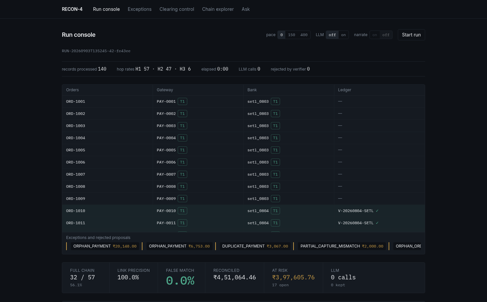
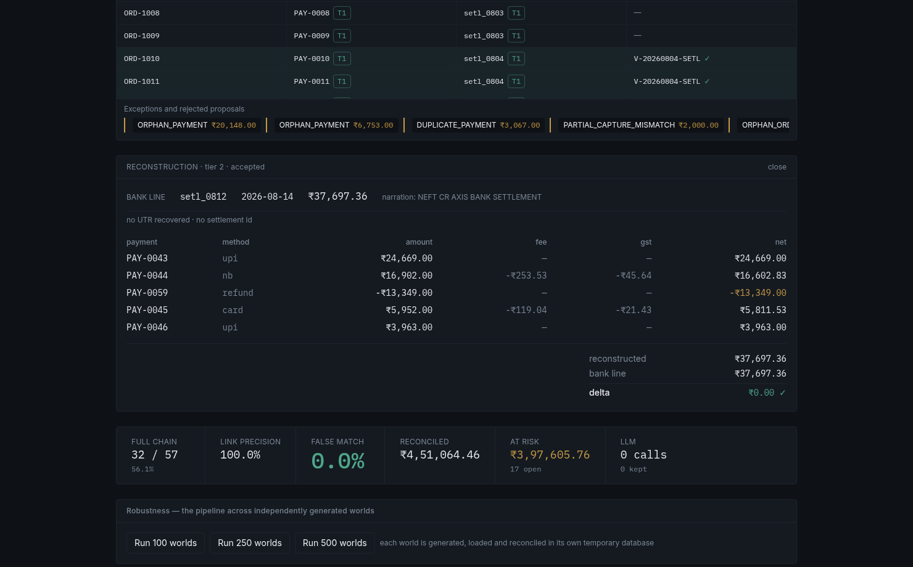
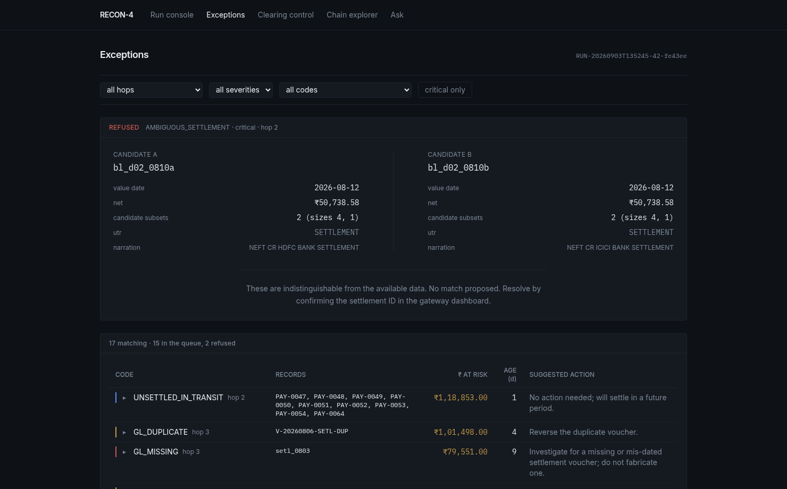
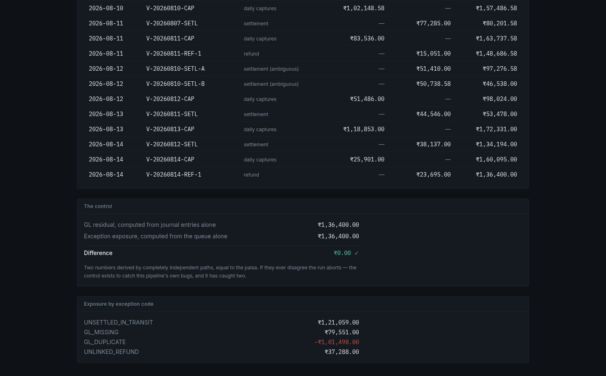
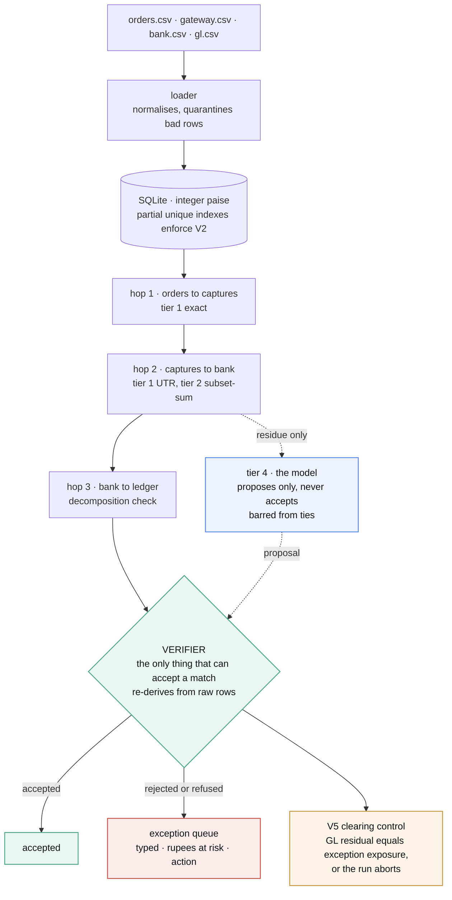

<div align="center">

# RECON-4

**Four-way payment reconciliation that proves what it matched — and refuses what it can't.**

orders → gateway captures → bank settlements → ledger entries

[](https://www.python.org/) [](#tests-and-gates) [](#tests-and-gates) [](#results) [](#quickstart)

Razorpay AI Buildathon · Track 04 — AI Finance Controller

</div>



Indian merchants reconcile four things by hand every day. The bank sends
back **one lump credit** with fees, GST and refunds already netted in, and
the reference is often truncated to uselessness.

RECON-4 closes that loop end to end. It proves every match it can —
including reconstructing settlements that share **no key at all**, by
subset-sum — refuses the ones it genuinely can't, and reports a measured
match rate, a typed exception queue with rupees at risk and a suggested
action for each, and a clearing-account control that must tie to the paisa
or the run aborts.

> **Non-goals, deliberately** (verbatim from `SPEC.md` §1): FX / cross-border ·
> rolling reserve · TDS 194-O · chargeback lifecycle beyond first appearance ·
> multi-currency · multi-merchant · GST-return matching · auth/void flows.

---

## Results

**Measured across 500 independently generated worlds, not one.**

| Worlds attempted (seeds 1–500) | Completed the pipeline | False-match rate | Clearing-control aborts |
|:--|:--|:--|:--|
| 500 attempted, 344 generated&nbsp;<sup>†</sup> | 344 | **0.0% on all 344** | **0** |

Across those 344 worlds: link precision **1.000 on every one**, link recall
0.913–0.992 (mean 0.985), full-chain rate 0.386–0.719 (mean 0.586).

<sup>†</sup> *156 seeds hit a defect injector with no structurally valid
candidate in that particular world — 136 of them D-01, which needs a 5–7
row batch containing exactly one refund. A generator limitation, not a
matching failure. Per-seed reasons are in
[`docs/eval_report_500.json`](docs/eval_report_500.json); the counting is in
`tests/eval_multi_seed.py`. Regenerate the whole table with `make eval` (~5 s).*

**The demo batch — seed 42, which every screen below uses:**

```
198 records · 0.05s · precision 100.0% · recall 99.1% · FALSE-MATCH RATE 0.0%
hop match H1 57/57 · H2 47/47 · H3 6/6 · full chain 32/57 = 56.1%
17 open exceptions (5 critical / 10 warn / 2 info) · ₹3,97,605.76 at risk
reconciled ₹4,51,064.46
clearing control: GL residual ₹1,36,400.00 == exception exposure ₹1,36,400.00 ✓
```

### Full chain is 32 of 57 — and here is where the other 25 went

Never quote that number without this table. All 25 are accounted for and
**none of them is a wrong match**:

| Why an order doesn't complete all four hops | Orders |
|:--|--:|
| Hasn't settled by the cutoff — the two in-transit batches, ₹1,21,059.00 of gross receivable, tracked with expected settlement dates | 11 |
| Belongs to the refused ambiguous pair (`PAY-0033`–`PAY-0037`) — the engine declines to attribute them to either twin settlement | 5 |
| Settled into `setl_0803`, whose GL voucher was deleted (defect D-05) — reported as `GL_MISSING`, ₹79,551.00 | 9 |

The middle row is the refusal costing chain rate, on purpose. The last row
is a real ledger defect the engine found and reported rather than papered
over. Recall is 99.1% rather than 100% for the same reason as the middle
row — refusing the ambiguous pair is the correct answer, and it costs recall.

---

## Quickstart

```bash
git clone https://github.com/Vyankatesh-Sabu/Recon && cd Recon
make demo          # generate → load → run → report. No API key needed.
```

`make demo` builds a fresh seed-42 world, loads it into a local SQLite
database, reconciles it end to end and prints the report (also written to
`data/report.json` and `data/report.html`). **`--llm off` is the default and
always works** — the LLM is never load-bearing (`CLAUDE.md` rule 5).

| Command | What it does |
|:--|:--|
| `make demo` | the whole pipeline, no API key |
| `make serve` | the API on <http://127.0.0.1:8000> |
| `make ui` | the frontend on <http://localhost:5173> (needs `make serve` running) |
| `make eval` | 500 worlds, ~5 s |
| `make demo-llm-wrong` | a deliberately wrong model, caught by the verifier |

Vite proxies `/api` and `/report` to port 8000, so run `make serve` in one
terminal and `make ui` in another.

<details>
<summary><b>Running tier 4 and the Q&amp;A agent against a real model</b></summary>

<br>

```bash
cp .env.example .env      # GEMINI_API_KEY or ANTHROPIC_API_KEY, RECON_LLM_PROVIDER
.venv/bin/python -m recon.cli run --llm on --no-narrate
```

`--no-narrate` runs adjudication alone (~15 s) instead of also regenerating
every exception's prose (~2 min). Without a key, `--llm on` still runs the
whole pipeline and reports honestly — every LLM-dependent decision abstains
instead of guessing.

</details>

---

## What broke, and how we got out

Everything had been measured on one seed. We decided that proved nothing,
built a harness to run the pipeline over hundreds of independently
generated worlds, and on the first 100 **the clearing control fired on
seven** — the check written specifically to catch our own mistakes.

Root-causing it took two layers:

1. **Hop 3** was mislabelling two genuinely different GL vouchers as
   duplicates, because they happened to share an amount and a date.
2. Fixing that **unmasked the same flaw one hop earlier** — the subset-sum
   matcher evaluated each bank line in isolation, so a single gateway row
   could "uniquely" satisfy two bank lines at once. A real false match,
   silently accepted, because V2's uniqueness index only rejects the
   *second* such proposal.

Two-pass collision detection fixed it. Re-ran 500 seeds: zero false
matches, zero aborts, 344 for 344. Both bugs have regression tests —
commits [`65b8f21`](../../commit/65b8f21) (the two matching bugs) and
[`cb7916e`](../../commit/cb7916e) (an earlier database-uniqueness scoping
bug, found the same way).

**A third, later and smaller, is worth naming because it's the same
lesson.** Tier 4 could never actually reach the verifier: the ambiguous
cases were correctly overridden before proposal, and the unexplained credit
was offered *zero* candidates. So "the verifier catches the model" was
untestable rather than true — and gate G4 passed precisely *because*
nothing was ever proposed. Fixed in `recon/llm/adjudicator.py`;
`make demo-llm-wrong` now demonstrates the rejection on real code.

---

## The screens that carry the argument

### Reconstruction — a settlement with no key at all

A settlement arrived with **no UTR and no settlement ID**. Nothing to join
on. So the engine reconstructs it by subset-sum: five gateway rows, fees and
GST netted per row, one refund subtracted, delta **₹0.00**. Every figure is
an API response — the browser adds nothing up.



### The refusal — the screen nobody demos

`bl_d02_0810a` and `bl_d02_0810b`: same value date, same net to the paisa,
two valid readings each, and the same useless reference token on both. The
engine **refuses**. There is deliberately no control on this card that would
let you pick one.



### The control — one number, two independent paths

The PG_RECEIVABLE T-account with a running balance, closing at
**₹1,36,400.00**, beside the two control numbers that reach that same figure
by completely independent paths — from the journal entries alone, and from
the exception queue alone. If they ever disagree, the run aborts.



### And when the model is wrong

```bash
make demo-llm-wrong
```

A stand-in that always picks the first candidate at 0.95 confidence, run
against the real pipeline. On the twins it isn't permitted to propose at
all — arithmetic can't tell a lucky pick from a wrong one. On the
unexplained credit it *does* propose, and the verifier re-derives the sum
and throws it out:

```
V1_failed (tier4/llm proposal rejected):
recomputed batch net 1697600p != bank credit 1800000p
```

False-match rate stays 0.0%; all 17 exceptions survive.

---

## Architecture



**What the shape of it is arguing**

| | |
|:--|:--|
| **Four sources, one loader** | Bad rows are quarantined, not fatal. A malformed statement line shouldn't take the run down. |
| **Integer paise end to end** | No float anywhere — `int` with a `_p` suffix, formatted to rupees only at display time. |
| **Three deterministic hops** | Hop 2 is real subset-sum reconstruction, not a lookup. That's how a settlement with no shared key gets matched at all. |
| **One verifier, sole authority** | Nothing else in the codebase may mark a match accepted, and it re-derives the arithmetic from raw rows rather than trusting whoever proposed it. |
| **Uniqueness lives in the database** | Partial unique indexes enforce "no record claimed twice", so the invariant can't be forgotten by application code. |
| **A control that can abort the run** | V5 computes one number two independent ways and stops everything if they disagree. It has caught two of our own bugs. |
| **The model is beside, not inside** | Tier 4 touches only the verifier — never a hop. It proposes on residue, is disposed of like any other proposal, and on a genuine tie it may not propose at all. |

> *Deterministic where money is decided. Probabilistic only where it can be
> checked. Measured across 344 worlds, not one.*

<details>
<summary><b>Repository map</b></summary>

<br>

| Path | What's in it |
|:--|:--|
| `recon/generator/` | the synthetic world, its 14 defect injectors, and the answer key |
| `recon/loader.py` | normalise and quarantine — never crash on a bad row |
| `recon/engine/hop1,2,3.py` | the three deterministic matchers; `subsetsum.py` is hop 2's core |
| `recon/engine/verifier.py` | V1–V5. **The only code that may accept a match** |
| `recon/llm/adjudicator.py` | tier 4 — builds the payload, enforces the tie refusal |
| `recon/llm/qa.py`, `tools.py` | the grounded Q&A loop and its four SQL-backed tools |
| `recon/api.py` | FastAPI: run, SSE stream, metrics, exceptions, match, clearing, eval |
| `web-app/` | Vite + React + TypeScript frontend; never computes a number |
| `db/migrations/` | plain SQL, applied in filename order |
| `tests/gates/` | one mandatory acceptance gate per phase |
| `tests/eval_multi_seed.py` | the 500-world harness behind the headline figure |
| `demo/llm_wrong_match.py` | the verifier catching a confidently wrong model |

</details>

---

## What the AI does, and what it doesn't

**The LLM never matches anything on its own.** Hops 1–3 and the verifier are
deterministic Python and SQL. The model is allowed to **propose** on the
small residue the deterministic tiers couldn't resolve, and every proposal
must pass the same independent verifier as everything else. On a genuine tie
it isn't even allowed to propose, because arithmetic can't tell a lucky pick
from a wrong one — and that refusal is enforced **in code**
(`recon/llm/adjudicator.py`), not by prompt. The Q&A agent retrieves through
four SQL-backed tools and narrates; it never computes a number.

Asked what the model contributes, the honest answer is: **a second opinion
that is allowed to abstain, and can't make things worse.** On the demo batch
a real model (Gemini `gemini-3.6-flash`) was shown all three residue cases
and abstained on all three — it agreed with the deterministic engine.

**Provider status, stated plainly.** Gemini has been run live, through
adjudication, narration, and multi-turn Q&A tool-calling. `AnthropicLLM` is
implemented against the same `LLMClient` protocol but **has not been run
live** — we're not claiming it works.

---

## What synthetic data proves — and doesn't

This batch is generated with a fixed seed and a known set of 14 injected
defects, each with a hand-written expected outcome in `ground_truth.json`.
That lets us prove something real: on this batch the engine's false-match
rate against a known-correct answer key is exactly 0.0%, every clean record
chains through all three hops, the ambiguous case is genuinely refused
rather than guessed, and the clearing-account control ties to the paisa.
That is a meaningful claim about the matching *logic* — the tiering, the
subset-sum reconstruction, the refusal rule, the verifier's independent
re-checks — because those are exercised exactly as they would be on real
data of the same shape.

It does **not** prove the system handles real-world mess it was never shown:
adversarial or malformed bank statement formats beyond the two data-quality
fixtures here, defect *combinations* beyond the ones injected, the non-goals
above, or scale (this is ~200 records, not millions). A synthetic answer key
is only as honest as the defects it encodes — this one encodes 14, not "all
of them".

The 344-world evaluation raises the floor considerably: the defects,
amounts, dates and batch shapes differ in every world, and the false-match
rate is 0.0% in all of them. It still doesn't make the data real.

---

## Standing rules

We wrote the engineering rules down **before** we wrote the code:
[`CLAUDE.md`](CLAUDE.md) — integer paise everywhere, SQLite with
load-bearing partial unique indexes, one explicitly-passed seeded RNG,
`make demo` green on `main` at every commit, the LLM never load-bearing,
refuse rather than guess, and only `verifier.py` may accept a match. Every
phase has a gate script in `tests/gates/`, and **a gate is never weakened
to make it pass.**

## Tests and gates

```bash
.venv/bin/python -m pytest -q tests/unit                       # 140 tests
for p in 1 2 3 4 5 6; do .venv/bin/python tests/gates/gate_p$p.py; done
make eval                                                       # 500 worlds
```

## Known issues

- **`AnthropicLLM` has never been run against the live API.** Implemented
  against the same protocol as the working Gemini backend, but unverified.
- **~27% of seeds can't generate a world at all** (mostly D-01, which needs
  a 5–7 row batch with exactly one refund). Documented above and counted in
  every reported figure rather than quietly dropped.
- **`api.py`'s evidence lookup is best-effort.** It follows any `match_link`
  touching an exception's records, which is *related to* but not always an
  *explanation of* that exception. The UI labels it as the linked match's
  evidence for exactly this reason.

---

<div align="center">

[`SPEC.md`](SPEC.md) — full design and phase plan ·
[`UI_SPEC.md`](UI_SPEC.md) — frontend spec ·
[`ROADMAP.md`](ROADMAP.md) — what was built, step by step

Built by **Vyankatesh Sabu**

</div>
