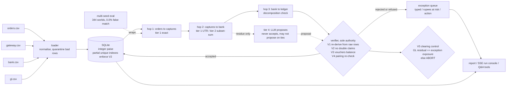

# RECON-4 — four-way payment reconciliation agent

Indian merchants reconcile four things by hand every day: orders, gateway
captures, bank settlements, and ledger entries — and settlements arrive as
one lump credit with fees, GST and refunds netted in, often with the
reference truncated. RECON-4 closes that loop end to end: it proves every
match it can (including reconstructing settlements with no shared key, by
subset-sum), refuses the ones it can't, and reports a measured match rate,
a typed exception queue with rupees at risk and a suggested action for
each, and a clearing-account control that must tie to the paisa or the run
aborts.

**Non-goals**, deliberately (verbatim from `SPEC.md` §1): FX / cross-border,
rolling reserve, TDS 194-O, chargeback lifecycle beyond first appearance,
multi-currency, multi-merchant, GST-return matching, auth/void flows.

---

## Headline results

**Measured across 500 independently generated worlds, not one.**

| Worlds attempted (seeds 1–500) | Completed the pipeline | False-match rate | Clearing-control aborts |
|---|---|---|---|
| 500 attempted, 344 generated\* | 344 | **0.0% on all 344** | 0 |

\**156 seeds hit a defect injector with no structurally valid candidate in
that particular world — 136 of them D-01, which needs a 5–7 row batch
containing exactly one refund. That is a generator limitation, not a
matching failure; the per-seed reasons are in
[`docs/eval_report_500.json`](docs/eval_report_500.json) and the counting is
in `tests/eval_multi_seed.py`. Regenerate the whole table with `make eval`
(~5 s).*

Across those 344 worlds: link precision 1.000 on every one, link recall
0.913–0.992 (mean 0.985), full-chain rate 0.386–0.719 (mean 0.586).

**The demo batch (seed 42), which every screen and every video beat uses:**

```
198 records · 0.05s · precision 100.0% · recall 99.1% · FALSE-MATCH RATE 0.0%
hop match H1 57/57 · H2 47/47 · H3 6/6 · full chain 32/57 = 56.1%
17 open exceptions (5 critical / 10 warn / 2 info) · ₹3,97,605.76 at risk
reconciled ₹4,51,064.46
clearing control: GL residual ₹1,36,400.00 == exception exposure ₹1,36,400.00 ✓
```

Full chain is 32 of 57. Never quote that number without the breakdown,
because all 25 of the rest are accounted for and none of them is a wrong
match:

| Why an order doesn't complete all four hops | Orders |
|---|---|
| Hasn't settled by the cutoff date — the two in-transit batches, ₹1,21,059.00 of gross receivable, tracked with their expected settlement dates | 11 |
| Belongs to the refused ambiguous pair (`PAY-0033`–`PAY-0037`): the engine declines to attribute them to either twin settlement | 5 |
| Settled into `setl_0803`, whose GL voucher was deleted (defect D-05) — reported as `GL_MISSING`, ₹79,551.00 | 9 |

The middle row is the refusal costing chain rate, on purpose. The last row
is a real ledger defect the engine found and reported rather than papered
over. Recall is 99.1% rather than 100% for the same reason as the middle
row — refusing the ambiguous pair is the correct answer, and it costs
recall.

---

## Quickstart

```bash
git clone <this repo> && cd <this repo>
make demo          # generate → load → run → report. No API key needed.
```

`make demo` builds a fresh seed-42 world, loads it into a local SQLite
database, reconciles it end to end and prints the report (also written to
`data/report.json` and `data/report.html`). **`--llm off` is the default
and always works** — the LLM is never load-bearing (`CLAUDE.md` rule 5).

```bash
make serve         # http://127.0.0.1:8000  — the API
make ui            # http://localhost:5173  — the frontend (needs `make serve` running)
make eval          # 500 worlds, ~5 s
make demo-llm-wrong  # what happens when the model is wrong
```

Vite proxies `/api` and `/report` to port 8000, so run `make serve` in one
terminal and `make ui` in another.

For `--llm on` and the Q&A agent, copy `.env.example` to `.env` and fill in
one key:

```bash
cp .env.example .env      # GEMINI_API_KEY or ANTHROPIC_API_KEY, RECON_LLM_PROVIDER
.venv/bin/python -m recon.cli run --llm on --no-narrate
```

`--no-narrate` runs adjudication alone (~15 s) instead of also regenerating
every exception's prose (~2 min). Without a key, `--llm on` still runs the
whole pipeline and reports honestly — every LLM-dependent decision abstains
instead of guessing.

---

## Architecture



1. Four sources, one loader that quarantines bad rows rather than crashing.
2. Money is integer paise all the way through — no float anywhere.
3. Three deterministic hops; tier 2 is real subset-sum reconstruction, not a lookup.
4. One verifier is the only thing that can accept a match, and it re-derives instead of trusting.
5. Uniqueness (no double claims) is enforced *in the database*, by partial unique indexes.
6. A clearing-account control computes one number two independent ways and aborts on mismatch.
7. The LLM sits *beside* the pipeline: it proposes on residue, is disposed of like any other proposal, and is barred from ties.
8. The whole thing is wrapped in a multi-seed evaluation — the accuracy number is measured across worlds, not on the demo.

*Deterministic where money is decided. Probabilistic only where it can be
checked. Measured across 344 worlds, not one.*

---

## The demo, screen by screen

Start `make serve` and `make ui`, then:

**Run console** (`/`) — set pace to `150` and press Start. Records travel
left to right across Orders · Gateway · Bank · Ledger and snap into chains;
tier badges appear per match; exceptions and any verifier rejections drop
into the gutter. The metrics band slides up on completion. Pacing is for
the camera — the real runtime is in the band.

**Reconstruction viewer** (click any `T2` row) — the subset-sum arithmetic
for a settlement that arrived with **no UTR and no settlement ID**. On seed
42, `setl_0812` reconstructs from four captures and one refund, fees and
GST netted per row, to a delta of ₹0.00. Every figure is an API response;
the browser adds nothing up.

**Refusal card** (`/exceptions`, above the queue) — `bl_d02_0810a` and
`bl_d02_0810b`: same value date, same net to the paisa, two valid readings
each, the same useless narration token. The engine refuses. There is
deliberately no control on that card that would let you pick one.

**Exception queue** (`/exceptions`) — 17 typed exceptions with rupees at
risk, age and a suggested action; filter by hop, severity or code; expand
any row for its evidence as a table.

**Clearing control** (`/clearing`) — the PG_RECEIVABLE T-account with a
running balance, closing at ₹1,36,400.00, beside the two control numbers
that reach that same figure by independent paths.

**When the model is wrong** — `make demo-llm-wrong`. A stand-in that always
picks the first candidate at 0.95 confidence, run against the real
pipeline: on the twins it is not permitted to propose at all, and on the
unexplained credit it proposes and the verifier throws it out with
`V1_failed (tier4/llm proposal rejected): recomputed batch net 1697600p !=
bank credit 1800000p`. False-match rate stays 0.0%; all 17 exceptions
survive.

---

## What the AI does, and what it doesn't

The LLM never matches anything on its own. Hops 1–3 and the verifier are
deterministic Python and SQL. The model is allowed to **propose** on the
small residue the deterministic tiers couldn't resolve, and every proposal
must pass the same independent verifier as everything else. On a genuine
tie it isn't even allowed to propose, because arithmetic can't tell a lucky
pick from a wrong one — that refusal is enforced in code
(`recon/llm/adjudicator.py`), not by prompt. The Q&A agent retrieves
through four SQL-backed tools and narrates; it never computes a number.

Asked what the model contributes, the honest answer is: **a second opinion
that is allowed to abstain, and can't make things worse.** On the demo
batch a real model (Gemini `gemini-3.6-flash`) was shown all three residue
cases and abstained on all three — it agreed with the deterministic engine.

Provider status, stated plainly: **Gemini has been run live**, through
adjudication, narration and the tier-4 path. `AnthropicLLM` is implemented
against the same `LLMClient` protocol but **has not been run live**. Gemini
multi-turn (used only by the Q&A console) currently fails on its second
turn — see "Known issues" below.

---

## What synthetic data proves — and doesn't

This batch is generated with a fixed seed and a known set of 14 injected
defects, each with a hand-written expected outcome in `ground_truth.json`.
That lets us prove something real: on this batch, the engine's false-match
rate against a known-correct answer key is exactly 0.0%, every clean record
chains through all three hops, the ambiguous case is genuinely refused
rather than guessed, and the clearing-account control ties to the paisa.
That is a meaningful claim about the matching *logic* — the tiering, the
subset-sum reconstruction, the refusal rule, the verifier's independent
re-checks — because those are exercised exactly as they would be on real
data of the same shape.

It does **not** prove the system handles real-world mess it was never shown:
genuinely adversarial or malformed bank statement formats beyond the two
data-quality fixtures here, defect *combinations* beyond the ones injected,
the non-goals above, or scale (this is ~200 records, not millions). A
synthetic answer key is only as honest as the defects it encodes — this one
encodes 14, not "all of them."

The 344-world evaluation raises the floor on that claim considerably: the
defects, amounts, dates and batch shapes differ in every world, and the
false-match rate is 0.0% in all of them. It still doesn't make the data
real.

---

## What broke, and how we got out

Everything had been measured on one seed. We decided that proved nothing,
built a harness to run the pipeline over hundreds of independently
generated worlds, and on the first 100 **the clearing control fired on
seven** — the check written specifically to catch our own mistakes.

Root-causing it took two layers. Hop 3 was mislabelling two genuinely
different GL vouchers as duplicates because they happened to share an
amount and a date. Fixing that unmasked the same flaw one hop earlier: the
subset-sum matcher evaluated each bank line in isolation, so a single
gateway row could "uniquely" satisfy two bank lines at once — a real false
match on those seeds, silently accepted, because V2's uniqueness index only
rejects the *second* such proposal. Two-pass collision detection fixed it.
Re-ran 500 seeds: zero false matches, zero aborts, 344 for 344.

Both bugs have regression tests. Commits
[`65b8f21`](../../commit/65b8f21) (the two matching bugs) and
[`cb7916e`](../../commit/cb7916e) (an earlier database-uniqueness scoping
bug, found the same way).

A third one, later and smaller, is worth naming because it is the same
lesson: tier 4 could never actually reach the verifier. The ambiguous cases
were correctly overridden before proposal, and the unexplained credit was
offered *zero* candidates — so "the verifier catches the model" was
untestable rather than true. Gate G4 passed because nothing was ever
proposed. Fixed in `recon/llm/adjudicator.py`; `make demo-llm-wrong` now
demonstrates the rejection on real code.

---

## Standing rules

We wrote the engineering rules down before we wrote the code:
[`CLAUDE.md`](CLAUDE.md) — integer paise everywhere, SQLite with
load-bearing partial unique indexes, one seeded RNG, `make demo` green on
`main` at every commit, the LLM never load-bearing, refuse rather than
guess, and only `verifier.py` may accept a match. Every phase has a gate
script in `tests/gates/`, and a gate is never weakened to make it pass.

## Known issues

- Gemini multi-turn (`converse`, used only by the Q&A console) fails on turn
  2 with `Function call is missing a thought_signature in functionCall
  parts`. Single-shot adjudication and narration work live. The console
  reports the failure rather than fabricating an answer.
- `AnthropicLLM` is implemented but has never been run against the live API.
- ~27% of seeds can't generate a world at all (mostly D-01). Documented
  above and counted in every reported figure.

## Tests and gates

```bash
.venv/bin/python -m pytest -q tests/unit                 # 139 tests
for p in 1 2 3 4 5 6; do .venv/bin/python tests/gates/gate_p$p.py; done
```

`SPEC.md` is the full design and phase plan; `UI_SPEC.md` covers the
frontend and the video.
