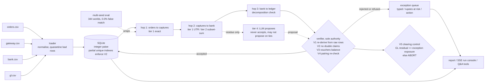

# SUBMISSION.md — everything that isn't code

Companion to `ROADMAP.md` (engineering). This file is the video, the
README, the architecture, the application-form answers, and the story.
Read `ROADMAP.md` §5 for the seed-42 numbers referenced throughout —
**regenerate them before recording; never type a number from memory.**

---

## 1. What we are being judged on

**The track brief (Razorpay Buildathon, Track 04 — AI Finance Controller):**
> Build an agent that closes one finance-ops loop across a 50+ record batch
> of synthetic data, reporting its match rate and the exceptions it could
> not resolve. *Why now:* verification capacity, not generation speed, is
> the bottleneck. *The bar:* Throughput plus measured accuracy plus an
> honest exception list. One cherry-picked match proves nothing.

**What they say they read, in their words:**
- **Problem taste** — did you pick something that actually matters
- **Build quality** — does it run, is it structured, would you trust it
- **AI judgment** — the right tool in the right place, *and where you chose not to use one*
- **Failure recovery** — what broke, and what you did about it. *"The last one is the one we read first."*

Two sentences to hold onto: *"verification, not generation, is the
bottleneck"* is our thesis, stated by the judges — a submission where a
model does the matching fails its own premise. And *"where you chose not to
use one"* means restraint with AI is scored, not penalised.

---

## 2. The story

### Three numbers carry the submission
1. **0.0% false-match rate — on 344 independently generated worlds, not one.**
   Measured against a ground-truth answer key written before the engine
   runs. This is the literal answer to "one cherry-picked match proves nothing."
2. **The clearing account ties to the paisa, two independent ways.** GL
   residual computed from journal entries alone == exception exposure
   computed from the queue alone. If they ever disagree, the run aborts.
   The control exists to catch *our* bugs — and it did (see §2 "what broke").
3. **17 honest exceptions, two of them refusals.** The engine names two
   settlements it cannot tell apart and declines to guess. Nobody demos a
   refusal.

### The AI stance — say it precisely, and under-claim
The LLM never matches anything on its own. Hops 1–3 and the verifier are
deterministic Python and SQL. The model is allowed to *propose* on the
small residue the deterministic tiers couldn't resolve, and every proposal
must pass the same independent verifier as everything else; on a genuine
tie it isn't even allowed to propose, because arithmetic can't tell a
lucky pick from a wrong one. The Q&A agent retrieves through four
SQL-backed tools and narrates; it never computes a number.

When asked what the AI contributes, the honest answer is: **a second opinion
that is allowed to abstain, and can't make things worse.** We measured it —
on our demo batch, a real model (Gemini) agreed with the deterministic
engine on all three residue cases. Say that. It reads as rigor. "Our agent
reconciles your books" reads as every other submission.

### The 56.1% sentence — never separate these
> Full chain: 32 of 57 orders go order → capture → settlement → ledger.
> **The rest haven't settled by the cutoff date** — they're the two
> in-transit batches (₹1,18,853), tracked with their expected settlement
> dates, not failures.

### What broke, and how we got out (the story judges read first)
Everything had been measured on one seed. We decided that proved nothing,
built a harness to run the pipeline on hundreds of independently generated
worlds, and on the first 100 **the clearing control fired on seven** — the
check we'd written specifically to catch our own mistakes. Root-causing it
took two layers. Hop 3 was mislabelling two genuinely different GL vouchers
as duplicates because they happened to share an amount and a date. Fixing
that unmasked the same flaw one hop earlier: the subset-sum matcher
evaluated each bank line in isolation, so a single gateway row could
"uniquely" satisfy two bank lines at once — a real false match on those
seeds, silently accepted. Two-pass collision detection fixed it. Re-ran 500
seeds: zero false matches, zero aborts, 344 for 344. Both bugs have
regression tests. (Commits `65b8f21`, and `cb7916e` for the earlier
database-uniqueness scoping bug.)

---

## 3. Application-form answers (drafts — edit to your voice)

**Track:** 04 — AI Finance Controller.
**Project name:** RECON-4.

**What it solves (≈90 words):**
> Indian merchants reconcile four things by hand every day: orders, gateway
> captures, bank settlements, and ledger entries — and settlements arrive
> as one lump credit with fees, GST and refunds netted in, often with the
> reference truncated. RECON-4 closes that loop end to end: it proves every
> match it can (including reconstructing settlements with no shared key by
> subset-sum), refuses the ones it can't, and reports a measured match
> rate, a typed exception queue with rupees at risk and a suggested action
> for each, and a clearing-account control that must tie to the paisa or
> the run aborts.

**What broke, and how you got out (≈180 words):** use §2's paragraph above.
**Short version (≈70 words):**
> We'd measured everything on one seed. Ran 100 independently generated
> worlds instead; our own clearing-account control — built to catch our
> bugs — fired on seven. Root cause was two layers deep: a duplicate
> misclassification in the ledger hop that, once fixed, exposed a real
> false match in the subset-sum matcher (each bank line evaluated in
> isolation). Fixed both, added regression tests, re-ran 500 seeds: 0
> false matches on all 344 that generated.

**AI judgment, if there's a box for it (≈60 words):**
> The LLM is not in the matching path — a false match is a critical bug and
> verification is the bottleneck, so matching stays deterministic and
> re-verified. The model may propose on unresolved residue, subject to the
> same verifier; on genuine ties it may not propose at all. We measured its
> contribution honestly: it agrees with the math and is allowed to abstain.

---

## 4. Architecture

Put this diagram in the README (GitHub renders Mermaid) and on one slide in
the video. It explains "would you trust it" and "where you chose not to
use AI" in the same picture.

**Eight things a judge should be able to see in it:**
1. Four sources, one loader that quarantines rather than crashes.
2. Money is integer paise all the way through — no float anywhere.
3. Three deterministic hops; tier 2 is real subset-sum reconstruction, not a lookup.
4. One verifier is the only thing that can accept a match, and it re-derives instead of trusting.
5. Uniqueness (no double claims) is enforced *in the database* by partial indexes.
6. A clearing-account control that computes one number two independent ways and aborts on mismatch.
7. The LLM is drawn *beside* the pipeline: proposes on residue, disposed like any other proposal, barred from ties.
8. The whole thing is wrapped in a multi-seed evaluation — the accuracy number is measured across worlds, not on the demo.

**Slide text (one line under the diagram):** *Deterministic where money is
decided. Probabilistic only where it can be checked. Measured across 344
worlds, not one.*

---

## 5. The video (4–5 minutes, the artifact judges see)

### Setup, once
- `rm -rf data && make generate && make load` (seed 42). Backend
  `.venv/bin/python -m recon.cli serve`; frontend `make ui`.
- Browser at 125% zoom, full-screen, no chrome, 1080p or better. Dark
  system theme so the ledger UI reads correctly.
- Regenerate `recon.cli report` and keep it open in a terminal — every
  number you say must match it.
- Record **beat by beat** (nine short clips), not one take. Retake beat 6
  until the pause lands. Say the unflattering numbers out loud.

### Shot list with narration
| # | Len | Screen | Say |
|---|---|---|---|
| 1 | 20s | Terminal: `head -40 data/ground_truth.json` | "This is synthetic data — I generated it, so here's exactly what that proves and what it doesn't. The answer key is written *before* the engine runs, so scoring against it means something." |
| 2 | 30s | Run console, pace 150, LLM off, click Start | "Orders, gateway, bank, ledger. Watch records travel left to right and snap into chains. Green rows are fully chained. Failures drop into the gutter, tinted by severity. It's paced for the camera — the real runtime is in the band." |
| 3 | 25s | Metrics band | "False-match rate: **zero point zero percent**. Precision 100, recall 99.1. Full chain 32 of 57 — **the rest haven't settled by the cutoff, those are the in-transit batches you'll see in the queue.**" |
| 4 | 20s | Terminal: `make eval` | "One cherry-picked match proves nothing. So: 344 independently generated worlds, zero false matches on every one of them. Five seconds." |
| 5 | 45s | Reconstruction viewer on `setl_0812` | "This settlement arrived with no UTR and no settlement ID. Here's how it matched: five gateway rows, fees and GST netted, a refund subtracted — rows stream in — and the delta resolves to zero. Every rupee, on screen." |
| 6 | 35s | Refusal card | "These two settlements are identical: same date, same amount to the paisa, two valid reconstructions each. The engine refuses. A wrong match is worse than an honest gap." **Pause two seconds.** |
| 6b | 30s | Terminal: `make demo-llm-wrong` | "What if a model guesses here? This one always picks the first candidate, confidently. On the twins it isn't even allowed to propose — arithmetic can't tell a lucky pick from a wrong one. On the unexplained credit it does propose — and the verifier throws it out. Verification is the product." |
| 7 | 30s | Clearing control | "The clearing account, computed two independent ways: from the ledger alone, and from the exception queue alone. Equal to the paisa. If they ever disagree the run aborts — that control caught two of our own bugs." |
| 8 | 30s | Run console with LLM on, narrate off → Adjudication panel *(or Q&A console if ROADMAP Step 9a passed)* | "With a real model on: three calls, three honest abstentions, each one checkable against the candidates it was shown. It agreed with the math." *(Q&A variant: ask the twins question live; point at the visible tool call and the cited IDs.)* |
| 9 | 25s | Exception queue | "Seventeen exceptions, typed, rupees at risk, a suggested action each. This is the list a controller actually works from." |
| 10 | 20s | Non-goals slide (§7) | "Eight things I deliberately didn't build." Read them. |

### Editing
- Hard cuts, no transitions. Captions for the three headline numbers.
- Under 5:00. Upload unlisted; put the link in the form.
- Nothing is typed into the UI by hand during recording except the Q&A
  question. Every number is an API response on screen.

---

## 6. README — section spec (write it from regenerated numbers)

1. **One paragraph:** what it is (the "What it solves" text from §3), and
   the non-goals in one line.
2. **Quickstart:** `make demo` (no key needed) · `make ui` · `.env` from
   `.env.example` for `--llm on` / Q&A. Ports. "LLM off always works."
3. **Headline results — above the fold.** Seed 42 line, then this table:

   | Worlds generated (seeds 1–500) | Completed the pipeline | False-match rate | Clearing-control aborts |
   |---|---|---|---|
   | 500 attempted, 344 generated* | 344 | **0.0% on all 344** | 0 |

   *\*156 seeds hit a defect injector with no structurally valid candidate
   (mostly D-01, which needs a 5–7 row batch with exactly one refund). Not
   a matching failure; documented in `tests/eval_multi_seed.py`.*
4. **Architecture** — the Mermaid diagram from §4 + the eight bullets.
5. **The demo beats as exact commands** — updated for the new UI (run
   console → viewer → refusal → clearing → queue → `make demo-llm-wrong`).
6. **What the AI does, and what it doesn't** — §2's "AI stance" paragraph.
   State plainly: Gemini verified live; `AnthropicLLM` implemented, not yet
   run live (if still true).
7. **What synthetic data proves — and doesn't** — keep the existing
   paragraph; it's good.
8. **What broke, and how we got out** — §2's paragraph, with commit links.
9. **Standing rules** — one line pointing at `CLAUDE.md` ("we wrote the
   rules down before we wrote the code; every phase has a gate script").
10. Tests & gates: the two commands.

---

## 7. Non-goals slide (verbatim from SPEC §1)
FX / cross-border · rolling reserve · TDS 194-O · chargeback lifecycle
beyond first appearance · multi-currency · multi-merchant · GST-return
matching · auth/void flows.

---

## 8. Plus points, ranked by value per hour
1. **The 344-world table above the fold in the README** and said out loud
   in the video. Cheapest, strongest thing on this list.
2. **`make demo-llm-wrong`** shown in the video — the only 30 seconds that
   *demonstrates* "verification not generation" instead of asserting it.
3. **Tag `v2.0` with `v1.0` left in place** — "there was a working fallback
   at every stage" is a build-quality signal.
4. **`CLAUDE.md` visible** — mention in README + one video sentence: "we
   wrote our standing rules down first; every phase had a gate that
   couldn't be weakened." Judges reading "is it structured" will open it.
5. **"What broke" section in the README with commit links** — they said
   it's the first thing they read; make it one click away.
6. **Commit a copy of the 500-seed eval output** to `docs/eval_report_500.json`
   (`data/` is gitignored) so the claim is inspectable per seed.
7. **A GIF of the run console** at the top of the README (record with the
   browser tools or any screen recorder; 10 s, pace 150).
8. **Architecture diagram in the README** (Mermaid renders on GitHub).
9. **Honest LLM paragraph** — under-claiming here is itself a plus point
   under "AI judgment."

---

## 9. What not to say
- Not "our agent reconciles your books." Say what matches (math) and what
  the model is allowed to do (propose, abstain).
- Not "100% accurate." Say 0.0% false-match, 99.1% recall, and why recall
  isn't 100 (the ambiguous pair is refused, correctly).
- Not "56.1%" on its own. Never.
- Not "supports Anthropic and Gemini" unless both were run live. Say which was.
- Not "AI-powered" anywhere. The judges told you what they think of that.

---

## 10. Before you submit the form (12 fields, ~15 minutes)
- [ ] Repo is **public**; `main` is at `v2.0`; a fresh clone passes `make demo`.
- [ ] README numbers regenerated today; 344-world table above the fold.
- [ ] Video uploaded (unlisted), under 5 min, every on-screen number matches `recon.cli report`.
- [ ] "What it solves" and "What broke" pasted from §3, read once aloud.
- [ ] `.env` not in git history (`git log --all -- .env` is empty).
- [ ] Track, project name, links: all four checked twice.
